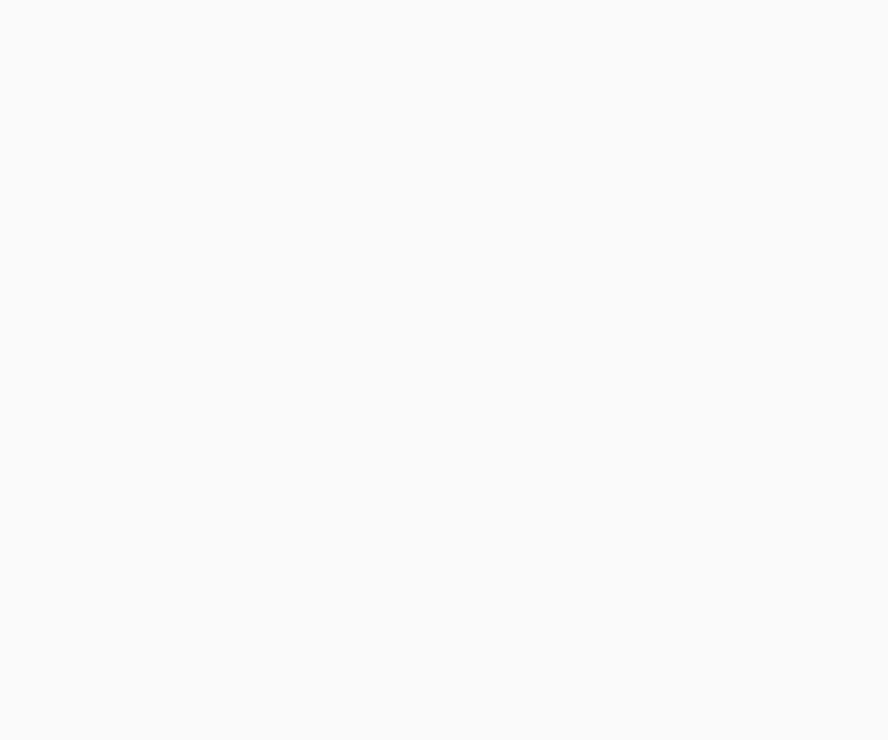

<h1>Sistema Financeiro Pessoal</h1>

  
  
  
  

  API backend para controle financeiro pessoal, desenvolvida como projeto de portfólio para demonstrar arquitetura limpa, segurança com JWT, persistência em PostgreSQL, geração de relatórios em PDF e documentação de API com Swagger/OpenAPI.

<h2>Visão Geral</h2>

  O sistema permite ao usuário registrar receitas e despesas, acompanhar metas financeiras, consultar um dashboard consolidado e gerar relatórios em PDF com seus lançamentos.

<ul>
  <li>Organização em camadas.</li>
  <li>Regras de negócio centralizadas em services.</li>
  <li>Endpoints enxutos.</li>
  <li>Validação de entrada.</li>
  <li>Testes unitários e de integração.</li>
  <li>Documentação clara para uso e manutenção.</li>
</ul>

<h2>Stack</h2>
<ul>
  <li>Java 21</li>
  <li>Spring Boot</li>
  <li>Spring Security</li>
  <li>JWT</li>
  <li>PostgreSQL</li>
  <li>Docker</li>
  <li>Maven</li>
  <li>Swagger/OpenAPI</li>
  <li>PDFBox</li>
  <li>JUnit 5</li>
  <li>Mockito</li>
</ul>

<h2>Funcionalidades</h2>
<ul>
  <li>Cadastro e autenticação com JWT</li>
  <li>Registro de receitas e despesas</li>
  <li>Metas financeiras por usuário</li>
  <li>Dashboard com saldo e visão consolidada</li>
  <li>Relatório PDF com os lançamentos autenticados</li>
  <li>API pública documentada com Swagger</li>
</ul>

<h2>Arquitetura</h2>
<ul>
  <li><code>auth/</code> autenticação e emissão de token</li>
  <li><code>transaction/</code> lançamentos financeiros</li>
  <li><code>goal/</code> metas financeiras</li>
  <li><code>dashboard/</code> agregações para painel</li>
  <li><code>report/</code> geração de PDF</li>
  <li><code>user/</code> persistência do usuário</li>
  <li><code>config/</code> segurança, JWT e OpenAPI</li>
  <li><code>exception/</code> tratamento centralizado de erros</li>
</ul>

  As regras de negócio ficam concentradas nos serviços. Os controllers apenas recebem a requisição, validam o contrato de entrada e delegam a execução para a camada apropriada.

<h2>Estrutura do Projeto</h2>
<ul>
  <li><code>backend/</code> aplicação Spring Boot</li>
  <li><code>docker-compose.yml</code> infraestrutura local com PostgreSQL</li>
  <li><code>.env.example</code> variáveis de ambiente esperadas</li>
  <li><code>mvnw</code> e <code>mvnw.cmd</code> wrapper do Maven</li>
</ul>

<h2>Como Executar Localmente</h2>
<ol>
  <li>Copie <code>.env.example</code> para <code>.env</code>.</li>
  <li>Suba o banco de dados:
    <pre><code>docker compose up -d</code></pre>
  </li>
  <li>Inicie a aplicação:
    <pre><code>.\mvnw.cmd -f backend\pom.xml spring-boot:run</code></pre>
  </li>
  <li>Acesse a documentação da API em <code>http://localhost:8080/swagger-ui/index.html</code>.</li>
</ol>

<h2>Endpoints Principais</h2>
<ul>
  <li><code>POST /api/auth/register</code></li>
  <li><code>POST /api/auth/login</code></li>
  <li><code>POST /api/transactions/income</code></li>
  <li><code>POST /api/transactions/expense</code></li>
  <li><code>GET /api/transactions</code></li>
  <li><code>POST /api/goals</code></li>
  <li><code>GET /api/goals</code></li>
  <li><code>GET /api/dashboard</code></li>
  <li><code>GET /api/reports/pdf</code></li>
</ul>

<h2>Testes</h2>
<pre><code>.\mvnw.cmd -f backend\pom.xml test</code></pre>
<ul>
  <li>Smoke test de contexto</li>
  <li>Testes unitários de autenticação</li>
  <li>Testes unitários de transações</li>
  <li>Testes unitários de metas</li>
  <li>Teste do dashboard</li>
</ul>

<h2>Captura de Execução</h2>

  

<h2>Decisões de Projeto</h2>
<ul>
  <li>O sistema foi mantido backend-only para reforçar a proposta técnica do portfólio.</li>
  <li>PostgreSQL é a fonte de verdade.</li>
  <li>JWT é utilizado para proteger os recursos do usuário autenticado.</li>
  <li>O relatório PDF é gerado localmente a partir dos dados persistidos.</li>
</ul>

<h2>Melhorias Futuras</h2>
<ul>
  <li>incluir frontend dedicado;</li>
  <li>adicionar paginação em listagens;</li>
  <li>ampliar observabilidade com logs estruturados;</li>
  <li>criar migrações versionadas caso o schema evolua com frequência.</li>
</ul>
